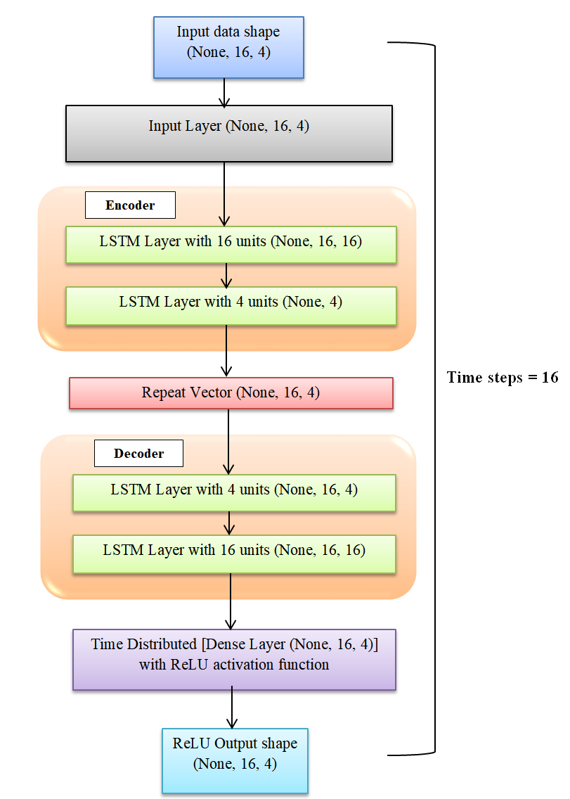

# Explaining deep LSTM models for detecting anomalies in time-series data (R&D Project)

This research work focuses on comparing the existing approaches to explain the decisions of models trained using time-series data and proposing the best-fit method that generates `explanations` for a deep neural network. The proposed approach is used specifically for explaining `LSTM` networks for `anomaly detection` task in `time-series data (satellite telemetry data)`.

## Author

- [@Jithin Sasikumar](https://www.github.com/Jithsaavvy)

## Acknowledgements

- [@German Aerospace Center (DLR)](https://www.dlr.de/DE/Home/home_node.html)
- [@Hochschule Bonn-Rhein-Sieg](https://www.h-brs.de/en)

## Languages and Tools
<p align="left"><a href="https://www.python.org" target="_blank" rel="noreferrer"></a><a href="https://www.tensorflow.org" target="_blank" rel="noreferrer"></a><a href="https://numpy.org/" target="_blank" rel="noreferrer"> </a><a href="https://jupyter.org/" target="_blank" rel="noreferrer"> </a> </p>

`Explainable AI (XAI)` methods are applied for `LSTM regression-based` anomaly detection models with different configurations `(simple/vanilla LSTM, encoder-decoder based LSTM, stacked LSTM and bi-directional LSTM)` for `satellite telemetry` data (time-series). These methods are compared based on the explanations obtained as a result of implementation as plots. A comparative analysis is performed by comparing the implemented methods based on generated results differentiating the methods fitting between differentiable and non-differentiable models.

## Why XAI?

It serves to answer the `why` questions such as - _Why a specific input data is classified as anomaly?_ _What features made the model to classify a specific data as anomalous ones?_ and so on. The model should be clear and evident in detecting anomalies. Any failure will ruin the complete system, in our case - it can imperil the entire satellite if the anomaly detection mechanism is not properly done, hence it is necessary to explain the models. Explanations are generated for the users to better understand about the model prediction. To facilitate that, these `explainable AI (XAI)` methods are used.
 
## Problem Statement

- The lack of `transparency` and `interpretability` in deep learning based models is a major drawback for understanding its decisions (or) predictions, making them as `black box` that restricts AI systems to be implemented in safety-critical applications in real-time with less supervision. Explainable AI is proposed to solve the black box problem.
- Efficient anomaly detection systems should be employed to monitor the satellite telemetry channels that produces high volumes of `telemetry data`. Any failure in detecting anomaly could endanger the whole satellite.
- Various methods (or) approaches are available for explaining and interpreting deep learning models, specifically for image and text data but a suitable method for a specific deep network architecture is not yet proposed for anomaly detection task using time series data.

## LSTM models used


All LSTM model architectures are illustrated in [images](./images/) folder. For example, the architecture of `encoder-decoder LSTM` with $16$ timesteps is depicted as follows: 



## XAI methods used
- [LRP](http://www.heatmapping.org/)
- [LIME](https://arxiv.org/abs/1602.04938)
- [SHAP](https://shap.readthedocs.io/en/latest/index.html#) <br>

## Notebooks

[LRP implementation](./notebooks/LRP_Implementation.ipynb) describes the implementation of `Layer-wise Relevance Propogation (LRP)` which is a `gradient-based attribution method` for LSTM regression model trained on time-series data along with their issues and limitations. It contains data pre-processing, model summary and implementation of LRP method. My observations are documented.

[LIME and SHAP implementation](./notebooks/LIME_and_SHAP_Implementation.ipynb) describes the implementation of `perturbation-based methods (SHAP and LIME)` for LSTM models with different architectures trained on time-series data along with their issues and limitations. It contains data pre-processing, model summary, model prediction, anomaly detection, SHAP and LIME implementation. All the models are developed from scratch using `tensorflow`, `keras` and trained except NASA model which is downloaded from [1] and based on [2]. The models are compared and my observations are documented.

## Results

### SHAP

SHAP force plot for vanilla LSTM


SHAP force plot for bi-directional LSTM


SHAP force plot for stacked LSTM


SHAP force plot for encoder-decoder LSTM


_In the above plot, it doesn't plot anything for encoder-decoder based LSTM due to the addition of flatten layers which resulted in the computation of zero SHAP values_.

### LRP

LRP is implemented for the `bi-directional LSTM` model as the current LRP implementation [3] supports only bi-directional LSTMs. which is also a deficit.


### LIME

`Thows an exception!!!` LIME is proposed to generate explanations for any classifier. So, LIME API expects the input model to be a classifier (i.e.) the model should output probabilities with sigmoid (or) softmax output layer as activations. As our model is regression based, it has `ReLU` activation output layer, and does not output any probabilities. 


## Comparative analysis


## Conclusions and Take aways

- Based on the comparative analysis and implementation, gradient based attribution methods serves to be the `best-fit approach` for LSTM regression based models. 
- Out of the perturbation based methods, `SHAP` fit for our models, as it generates `global explanations` and works for any models other than classifiers whereas `LIME` does not work for regression models.
- But SHAP is not a best-fit approach for neural networks, because all the perturbation based methods are proposed to work for `non-differentiable models`. They do work for neural networks as well but they are not optimized.
- SHAP performs very `slower` than LRP for LSTM network based on the [execution
time](./result%20plots/comp%20table%20new.PNG).
- Thus, `LSTM` network being a `differentiable model` (model with gradients) works best with gradient based methods. It can be concluded that `gradient-based methods` are the best fit methods exclusively for LSTM regression based neural networks.

## Future works
- The research work can be extended to implement the other explainable methods like `integrated gradients`, `DeepLIFT` and so on, as they were not implemented in this work due to time constraints.
- Current LRP implementation is supported only for bi-directional LSTM models. It can be extended to support multiple LSTM model architectures with additional functionalities.
- `Optimal evaluation metrics` for evaluating the explanations generated by XAI methods for LSTM networks using time series data for anomaly detection is not proposed.

### _Note !!!_
1. _As this is a research project, the implementation and other details are demonstrated using `jupyter notebooks`. Also, the code is `not refactored`._
2. _This work was carried out between **June 2020 to March 2021**. All the tools and libraries used, implementation details were based on the ones available during that time frame._

## Citation

If you want to use this work, please cite:

```
    title = {Explaining deep learning models for detecting anomalies in time-series data},
    author = {Jithin Sasikumar}, 
    month = "02",
    year = "2021",
}
```

## References

[1] https://github.com/khundman/telemanom <br>
[2] Kyle Hundman, Valentino Constantinou, Christopher Laporte, Ian Colwell, and Tom Soderstrom.Detecting spacecraft anomalies using lstms and nonparametric dynamic thresholding. In Proceedings of the 24th ACM SIGKDD International Conference on Knowledge Discovery amp; Data Mining, KDD ’18, page 387–395, New York, NY, USA, 2018. Association for Computing Machinery. ISBN 9781450355520. doi: 10.1145/3219819.3219845. URL https://doi.org/10.1145/3219819.3219845 <br>
[3] AlexanderWarnecke. Layerwise Relevance Propagation for LSTMs, 2021. URL https://github.com/alewarne/Layerwise-Relevance-Propagation-for-LSTMs. Accessed on: 2021-02-06. [Online]. <br>
[4] https://www.kaggle.com/datasets/vinayak123tyagi/bearing-dataset
